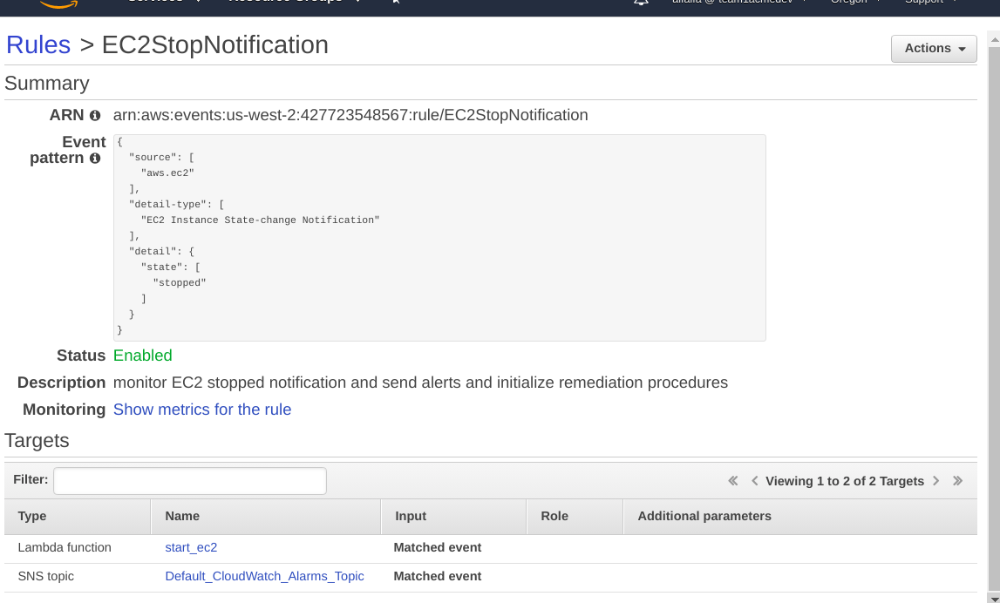

# Team 1, Acme Corp., Developers Division

Systems Operations Control team will analyze all requirements and create the appropriate configurations and document the outcome of their analysis and deployment.

- [x] Documentation of configurations and defined policies

- [x] [Network and Systems architecture diagrams](acme-developers.pdf)

- [x] setups should be verified to be working properly to be considered complete

- [x] If you are going to use any services that incur a cost you must report what that service will cost daily/monthly.

  **COSTS**
  * EIP for nat (4 hours 19 cents)
  * S3 for cloudtrail
  * GuardDuty - 30-day free trial
  * Inspector - 30-day free trial
  * S3 with replication
  * Config 

## **Organizations - (OU)**
The company will need to manage multiple organizations units to separate divisions within the business.

- [ ] Ensure that all organizations cannot disable CloudTrail logging in any organization via Service Control Policy
- [x] The development environment should only have access to development related resources
- [x] Prevent users within the Development environment from disabling Config or changing any of it's rules - **only SysOps have config access**

## **IAM**
- [x] All organizations should have best practices applied for password security and console access policies - **Auditors do not have programmatic access**
- [x] Appropriate groups should be created with multiple users created for various groups

MFA to be done soon


Only SysOps, NetworkAdmins, and DBAdmins have programmatic access. Auditors only have console access


## **Networks - (VPC)**

- [x] All environments should be configured to support multi availability zone distribution.

  **Developers Network**

  * public subnet -- http(s) outbound, SSH inbound with EC2 for bastion host with internet gateway and temporarily a NAT gateway

  * private subnet -- dokuwiki docker and mysql, EC2 required for updates
  SSH inbound, mysql inbound

  * CONFIG file in host machine for bastion host setup
```
Host team1-acme-dev-public
   Hostname xx.xx.xx.xx
   User ec2-user
   Port 22
   ForwardAgent yes
   IdentityFile ~/.ssh/team1-acme-dev-key.pem

Host team1-acme-dev-private
   User ec2-user
   ProxyCommand ssh team1-acme-dev-public nc 10.4.2.162 22
   ForwardAgent yes
   IdentityFile ~/.ssh/team1-acme-dev-key.pem
```
  * **NAT gateway attached to public instance**


  * **Private Route Table with reference to NAT gateway**


  * bastion worked


## **Documents - S3**
- [x] Developers need a secure location to store file uploads from various applications, these files should support versioning. Block public access
- [x] Documents should be ensured to be stored in multiple regions for reliable backups and guaranteed accessibility


with replication rule to create redundancy


## **Websites and Apps**

- [x] dokuwiki for developer internal use

```
sudo yum install docker
sudo systemctl start docker
sudo docker images
```

**awslogs service installation**

```
sudo yum install awslogs
sudo service awslogs start

sudo docker run --restart always -d -p 80:80 --log-driver=awslogs --log-opt awslogs-region=us-west-2 --log-opt awslogs-group=myNewDockerLogGroup --log-opt awslogs-create-group=true mprasil/dokuwiki

elinks http://localhost/install.php
  ```
~~account: nemo~~
accessible only from within internal network
  

- [x] MySQL for internal use(mariadb) only within internal network


- [x] Docker logging solution: cloudwatch for docker
```  
sudo yum install -y awslogs
sudo systemctl start awslogsd
sudo systemctl enable awslogsd.service
```
  * created a cloudwatch agent
    with the following policies:
```
{
    "Effect": "Allow",
    "Action": [
        "cloudwatch:PutMetricData",
        "ec2:DescribeTags",
        "logs:PutLogEvents",
        "logs:DescribeLogStreams",
        "logs:DescribeLogGroups",
        "logs:CreateLogStream",
        "logs:CreateLogGroup"
    ],
    "Resource": "*"
}
```


### **Legal wordpress**
- [x] The legal department needs a Wordpress installation to manage corporate intranet assets

- [x] RDS MySql for Wordpress Legal


* Wordpress Legal


* signature groups


## **Servers - EC2**
- [x] Servers should be accessible via bastion over SSH but not publicly accessible via SSH w/ the exception of bastion(s)

- [x] Patching with SSM
**Server patching with Systems Manager (SSM)**
  * created a role with policy **AmazonSSMManagedInstanceCore** and attached to EC2 instances to be patched and then set up patch manager in Systems Manager

  * patch description


  * patch task


  * patch history


**Config**
- [x] standard configuration in Config
  * public

  * private


**EC2 monitoring**

- [x] startup to install and configure an agent to send custom CloudWatch events for CPU monitoring
  * [resource](https://docs.aws.amazon.com/AmazonCloudWatch/latest/monitoring/US_AlarmAtThresholdEC2.html)

  * configure cloud watch agent: make sure that there's an IAM role attached to EC2 that will allow cloudwatch, ex: CloudWatchAgentServerRole
  * do the following in EC2 instance command line:

```
wget https://s3.amazonaws.com/amazoncloudwatch-agent/amazon_linux/amd64/latest/amazon-cloudwatch-agent.rpm
sudo /opt/aws/amazon-cloudwatch-agent/bin/amazon-cloudwatch-agent-config-wizard
sudo rpm -U ./amazon-cloudwatch-agent.rpm
sudo aws configure --profile AmazonCloudWatchAgent
sudo /opt/aws/amazon-cloudwatch-agent/bin/amazon-cloudwatch-agent-ctl -a fetch-config -m ec2 -s
```
**CPU monitoring**

**CPU utilization alert**


**User Data**
- [x] All servers that host applications should use a User Data script upon startup to send Docker logs to CloudWatch. https://docs.aws.amazon.com/AmazonCloudWatch/latest/monitoring/install-CloudWatch-Agent-commandline-fleet.html

    * Make sure that awslogs and docker services are installed
    * [user data](https://docs.docker.com/config/containers/logging/awslogs/):
```
Content-Type: multipart/mixed; boundary="//"
MIME-Version: 1.0

--//
Content-Type: text/cloud-config; charset="us-ascii"
MIME-Version: 1.0
Content-Transfer-Encoding: 7bit
Content-Disposition: attachment; filename="cloud-config.txt"

#cloud-config
cloud_final_modules:
- [scripts-user, always]

--//
Content-Type: text/x-shellscript; charset="us-ascii"
MIME-Version: 1.0
Content-Transfer-Encoding: 7bit
Content-Disposition: attachment; filename="userdata.txt"

#!/bin/bash
sudo service awslogs start
sudo service docker start
sudo docker run --restart always -d -p 80:80 --log-driver=awslogs --log-opt awslogs-region=us-west-2 --log-opt awslogs-group=myNewDockerLogGroup --log-opt awslogs-create-group=true --name mywikipad mprasil/dokuwiki:latest
--//
```

## **Logs**
- [x] S3 bucket for cloudtrail (with lifecycle) - 30 days standard access, delete after 90 days


## **Monitoring - Cloudwatch, SNS, Lambda**

- [x] Operations should get alerts whenever an EC2 changes goes into a stopped state and when the EC2 is remediated


**Start EC2 code**
```
import json
import boto3

ec2 = boto3.resource('ec2')

def lambda_handler(event, context):
    id = event["detail"]["instance-id"] #get instance id from event
    
    instance = ec2.Instance(id)
    instance.start()

    return {
        'statusCode': 200,
        'body': 'Instance ID:' + json.dumps(instance.instance_id + ' started')
    }
```

**Cloudwatch rule**


- [x] Operations should get alerts whenever and EC2 is terminated


- [ ] Operations should get alerts whenever an EC2 is started and doesn't comply to standard configuration, the server should also be terminated

**Cloudwatch Dashboard**

- [x] dashboard to monitor key system metrics and network traffic


**Inspector**
- [x] Enable GuardDuty


**GuardDuty**
- [x] Enable Inspector


## **Alerts - SNS**
**Rules for log tampering**
- [x] Send an alert whenever Cloudtrail controls are tampered with
- [x] Send an alert whenever CloudWatch controls are tampered with


**email alerts**


**monitoring the root**
- [x] Send an alert whenever someone logs in with the root user account for any organization


SNS notification
