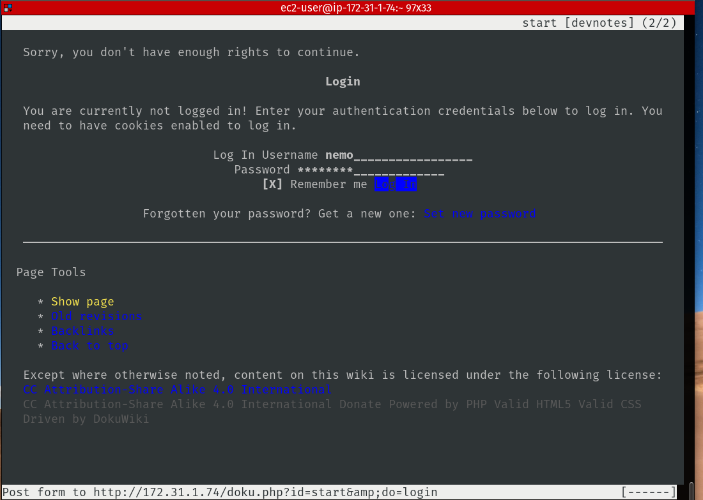
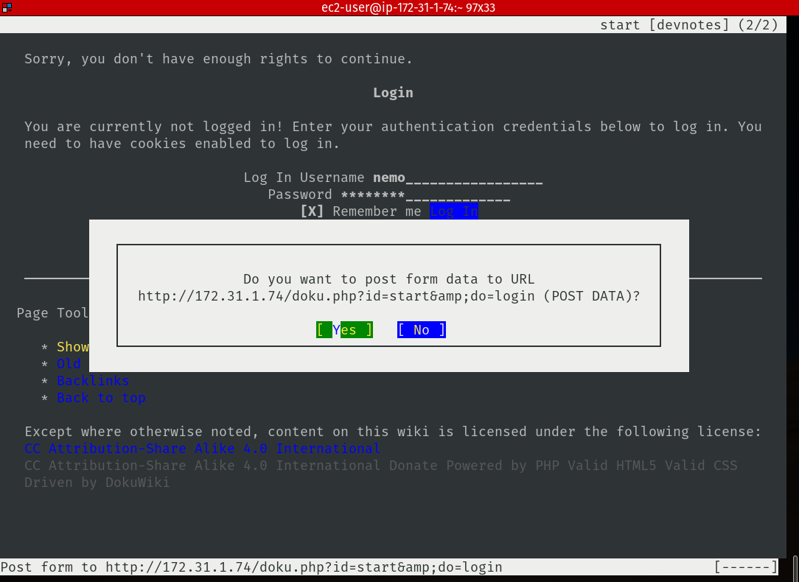
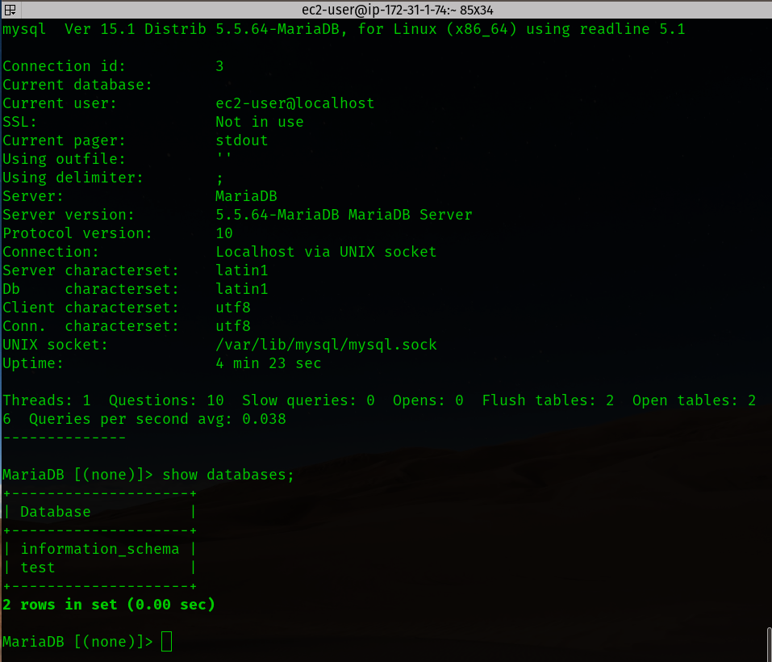

# Team 1, Acme Corp.

You must architect, design and create the Enterprise infrastructure for Acme Corp. The provided requirements are high level needs as identified by various stakeholders but should not be considered complete in detail. 

It is assumed that the Systems Operations Control team will analyze all requirements and create the appropriate configurations and document the outcome of their analysis and deployment.

Requirements for deliverables from this project include:

  * Documentation of configurations and defined policies **ALL OF US**
  * Systems architecture diagrams - **ALL OF US**
  * Network architecture diagrams - **John**
 
 **NOTE:** All setups should be verified to be working properly to be considered complete.

 **NOTE:** If you are going to use any services that incur a cost you must report what that service will cost daily/monthly. **James**

## Organizations - James (OU)
The company will need to manage multiple organizations units to separate divisions within the business.

  * Ensure that all organizations cannot disable CloudTrail logging in any organization via Service Control Policy
  * Production
  * Development
    * The development environment should only have access to development related resources
    * Prevent users within the Development environment from disabling Config or changing any of it's rules
  * Legal
  * Research & Development
    * The research environment should never allow servers to be accessible from the public internet via Internet Gateway, connecting to a NAT Gateway temporarily to patch systems or download software is acceptable

## Users/Groups/Roles - (IAM)
  
  * All organizations should have best practices applied for password security and console access policies - **All of us in respective division**
  * Appropriate groups should be created with multiple users created for various groups - **All of us in respective division**

## Systems Operations Control team
* James - HQ
* Jen - Marketing
* Jo - Legal / Finance
* John - Research & Development
* Alf - Development

## Networks - (VPC)

All environments should be configured to support multi availability zone distribution.
  
  * Developers
  * Marketing
  * Finance
  * Research & Development

### OUs from James, with a tentative mapping to VPCs from Alf

* Parent HQ
  * centralized Cloudwatch
* R&D with its own VPC
* Prod - nominally and hierarchically
  * Marketing VPC
  * Finance / Legal VPC
* Dev with its own VPC

## Summary of Tasks (with exception of monitoring and SNS)

### (Tentative) Leads, VPCs, subnets and AWS services

* HQ - **CTO James**
  * OU
  * S3 for [centralized Cloudtrail](https://docs.aws.amazon.com/awscloudtrail/latest/userguide/cloudtrail-receive-logs-from-multiple-accounts.html)
  * IAM

* Developers - **admin Alf**
  * public subnet -- http outbound
  and EC2 for bastion host
  * private subnet -- dokuwiki docker and mysql, EC2 required for updates
  * cloudwatch for docker
  * private S3 with replication
  * S3 bucket for cloudtrail (with lifecycle) - give S3 ARN to James

* Research & Development - **admin John**
  * public subnet -- http outbound
  and EC2 for bastion host and nat gateway
  * private subnet -- EC2 for updates nat in route table
  * S3 bucket for cloudtrail (with lifecycle) - give S3 ARN to James

* Marketing - **admin Jen**
  * public subnet -- http outbound
  and EC2 for bastion host
  * private subnet - wordpress docker and EC2 for updates
  * cloudwatch for docker
  * marketing public static site S3 with replication
  * marketing private S3 with replication
  * S3 bucket for cloudtrail (with lifecycle) - give S3 ARN to James

* Finance - **admin Jo**
  * public subnet -- http outboud and EC2 for bastion host
  * ~~finance private~~
  * legal private - for wordpress and EC2 for updates
  * cloudwatch for docker
  * legal S3 with replication
  * S3 bucket for cloudtrail (with lifecycle) - give S3 ARN to James

* Production - no specific AWS requirements. no AWS VPC infrastructure. There might be some on-premise infrastructure but not specified yet.

## Documents - (S3 with Replication)

  * Documents should be ensured to be stored in multiple regions for reliable backups and guaranteed accessibility
  * Legal needs a secure location to store legal documents that are not accessible by the public or any other users outside of their group
  * Marketing needs a secure location to store creative and digital assets
  * Developers need a secure location to store file uploads from various applications, these files should support versioning 
  * Ensure that files are stored securely

## Websites - Jen and Jo

  * The marketing department needs a simple static website that can be accessed quickly from anywhere in the world - **S3 -- one public for website and one private for internal assets**
  * The legal department needs a Wordpress installation to manage corporate intranet assets - **EC2 or Docker**
  
## Servers - Alf (EC2)

  * Servers should be accessible via bastion over SSH but not publicly accessible via SSH w/ the exception of bastion(s)

    * [bastion lecture 1](https://youtu.be/B5qx2QQ3UaY?t=3113)
    * [bastion lecture 2](https://youtu.be/QURN-nJJZj4?t=2756)
  * Servers should be able to be patched any time with Systems Manager
  * Servers should store their standard configuration in Config
  * All servers should use a User Data script upon startup to install and configure an agent to send custom CloudWatch events for CPU monitoring

      * [cloud-init](https://aws.amazon.com/premiumsupport/knowledge-center/execute-user-data-ec2/)
      * [cloud watch user data](https://docs.aws.amazon.com/AmazonCloudWatch/latest/logs/QuickStartEC2Instance.html)
  
  * All servers that host applications should use a User Data script upon startup to send Docker logs to CloudWatch **(hard mode)**
    * [cloud-init](https://aws.amazon.com/premiumsupport/knowledge-center/execute-user-data-ec2/)
    * [user data](https://docs.docker.com/config/containers/logging/awslogs/)
  
## Applications - Jen and Alf

  * Dokuwiki in a Docker container for the developers to use - **Alf**
  
  

  * Wordpress in a Docker container for the marketing staff to use - **Jen**
  * The developers will need a MySQL database installed on a small EC2 - **Alf**
  
  * Enable WAF for the Wordpress application and configure it to block all traffic containing possible XSS and SQLi attempts - **Jen**

## Databases - depends on which database

  * Databases should be on private subnets and never be available from the internet
  * Wordpress should use a small RDS with proper security controls

## Logs

  * Ensure that all logs are tamper proof from all organizations to ensure non-repudiation by sending all Cloudtrail logs to a single organization ([centralized Cloudtrail documentation](https://docs.aws.amazon.com/awscloudtrail/latest/userguide/cloudtrail-receive-logs-from-multiple-accounts.html)) - **James**
  * Ensure that logs are readily accessible for a period of 30 days and create an archival strategy/implementation that logs are stored by the organization for 90 days and then deleted (cloudtrail in each division with S3 Lifecycle set up) - **All admins**
  * Auditors should have read-only access for all logs across the organization - **James**
  * All applications should have a valid logging solution - **Jen, Jo, Alf**

    [flow logs lecture](https://youtu.be/B5qx2QQ3UaY?t=5461)

## Monitoring - Lambda and Cloudwatch, low priority

  * Operations should get alerts whenever an EC2 changes goes into a stopped state and when the EC2 is remediated - L & C
  * Operations should get alerts whenever and EC2 is terminated - L & C
  * Operations should get alerts whenever an EC2 is started and doesn't comply to standard configuration, the server should also be terminated - L & C
  * Create a dashboard in each account to monitor key system metrics and network traffic - Cloudwatch
  * Enable [GuardDuty](https://aws.amazon.com/guardduty/) to monitor baseline activity and anomolies across the system
  * Enable [Inspector](https://aws.amazon.com/inspector/) and configure to run nightly scans of all of your applications and networks

## Alerts - SNS, group, low priority

  * Send an alert whenever Cloudtrail controls are tampered with
  * Send an alert whenever CloudWatch controls are tampered with
  * Send an alert whenever someone logs in with the root user account for any organization